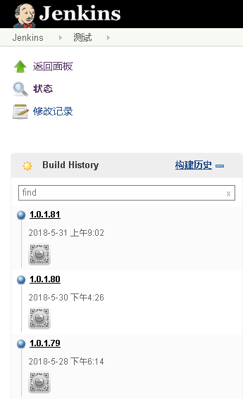
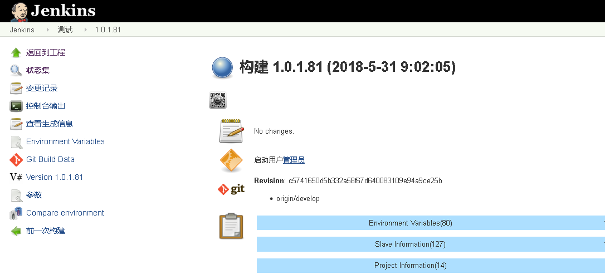
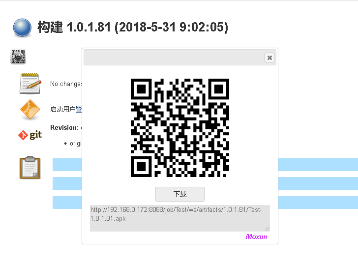
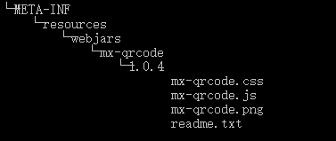

# qrcode4jenkins
Jenkins上显示二维码

    请在Set build description，中增加以下内容
    
<a id="mx-uri" href="所需生成二维码链接"/>

需要安装插件

[HTMLResource Plugin](https://wiki.jenkins.io/display/JENKINS/HTML+Publisher+Plugin)
、
[Description Setter Plugin](https://wiki.jenkins.io/display/JENKINS/Description+Setter+Plugin)

以及在HTML Resource中上传配置
jquery-ui-1.12.1.jar、jquery.qrcode-0.12.0.jar

将src中文件打包进一个符合wabjar目录的jar文件

